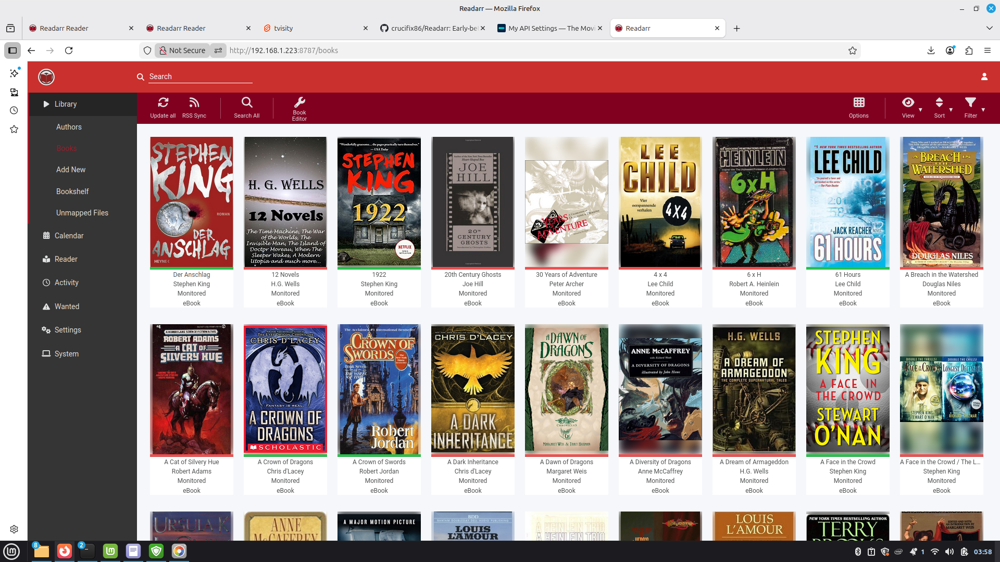
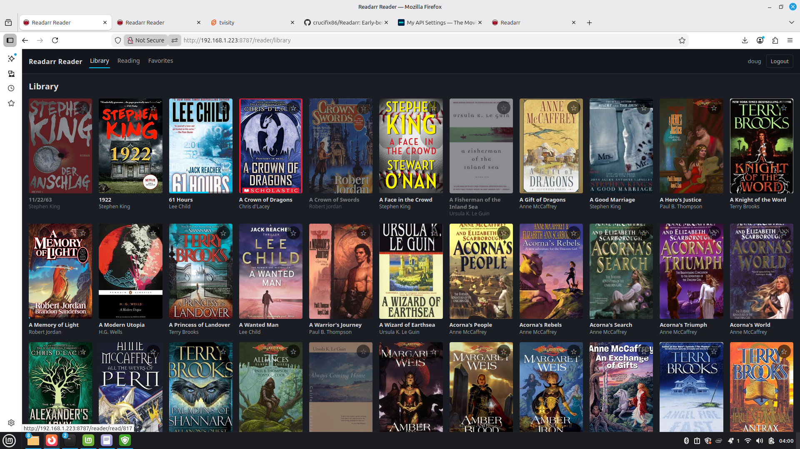
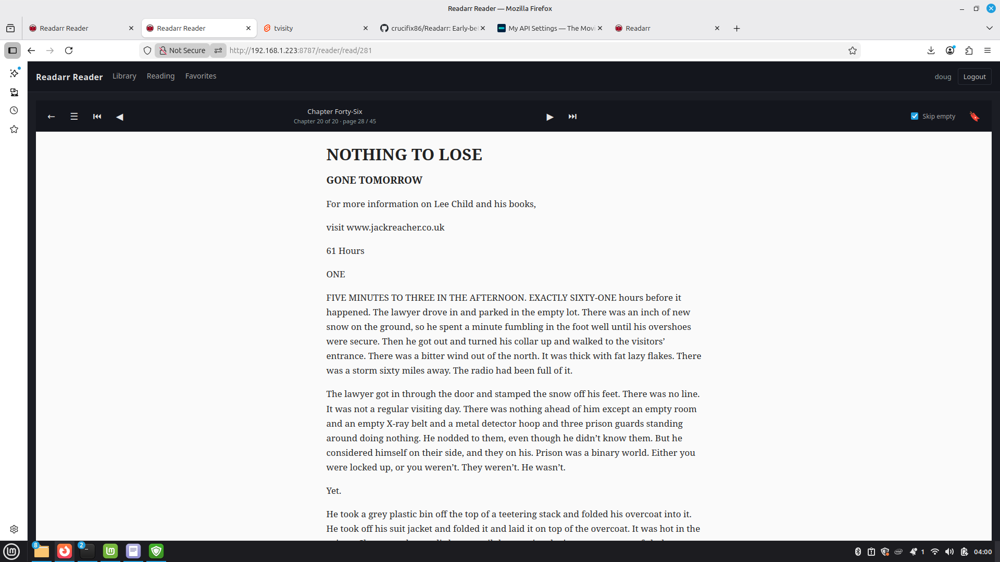

# Readarr (crucifix86 revival fork)

[](https://github.com/crucifix86/Readarr/actions/workflows/docker-build.yml)
[](https://github.com/crucifix86/Readarr/actions/workflows/readarr-ci.yml)

> **Beta — usable.**
> Used daily against a 500+ book library with SABnzbd + qBittorrent on Unraid. Matching, identification, renaming, and imports all working end-to-end. Still expect the occasional rough edge around multi-book omnibuses and metadata gaps (see *Known edges* below). **Keep a backup of your library DB before major upgrades.** A dedicated metadata server is in the works; until it ships, this fork points at the community `api.bookinfo.pro` instance by default.

Readarr is an ebook and audiobook collection manager for Usenet and BitTorrent users. It can monitor multiple RSS feeds for new books from your favorite authors and will grab, sort, and rename them.

**This fork also *serves* the books** — something upstream never did. The same Docker container ships an OPDS 1.2 catalog for external readers (Moon+ Reader, KyBook, KOReader, Calibre Companion, etc.), a multi-user model with per-user API keys, and a dedicated web reader portal at `/reader` with server-side EPUB rendering. See [Reader portal](#reader-portal-reader) below.

Note that only one type of a given book is supported per instance. If you want both an audiobook and ebook of a given book you will need multiple instances.

## About this fork

The original Readarr project was retired by the Servarr team in mid-2025 after its metadata provider went down. This fork builds on the excellent work of [@Faustvii](https://github.com/Faustvii/Readarr) (perf + reliability fixes, Docker/CI wiring, OpenTelemetry) and [@ricetim](https://github.com/ricetim/readarr-rresurrected) (native Bibliotik + MyAnonamouse indexers, AllowedLanguages filter, UI niceties), with additional work on top.

Not affiliated with, endorsed by, or related to the Servarr team.

## Screenshots

**Admin UI** — the familiar Readarr library view with a new **Reader** entry in the left sidebar that opens the in-browser reader portal:



**Reader portal** (`/reader`) — separate end-user webapp. Users log in with credentials the admin creates in Settings → Users; responsive dark-theme library grid with covers, progress bars, and favorites. No admin UI exposed:



**In-browser reader** — server-side EPUB rendering (Kavita-style), no client-side epub library. Chapter label + progress bar, TOC sidebar, keyboard / swipe navigation, bookmarks, "skip empty pages" toggle for Calibre-split epubs:



## Quick start (Docker)

```bash
docker run -d --name readarr \
  --restart unless-stopped \
  -p 8787:8787 \
  -e TZ=America/Los_Angeles \
  --user 1000:1000 \
  -v ~/readarr-config:/config \
  -v /path/to/books:/books \
  -v /path/to/downloads:/data \
  ghcr.io/crucifix86/readarr:latest
```

Then open http://localhost:8787. The metadata URL is pre-wired to `api.bookinfo.pro`; override it in **Settings → General → Development → Metadata Source** if you run your own.

On Unraid, use `--user 99:100` (nobody:users).

### Mobile apps

No Readarr-specific mobile app exists, but the generic Servarr client **[LunaSea](https://www.lunasea.app/)** (free, iOS + Android) supports Readarr alongside Sonarr/Radarr/Lidarr/Prowlarr. Add a Readarr profile, enter `http://<your-host>:8787` + your API key (from *Settings → General*), and you get a queue/history/manual-search/library-browse mobile UI.

For *reading* on mobile, the reader portal at `http://<host>:8787/reader` is responsive (touch-friendly tap zones, off-canvas sidebar, swipe-to-turn). Or point any OPDS-aware reader (Moon+ Reader, KyBook, KOReader, etc.) at `http://<host>:8787/opds` — use a per-user ApiKey from Settings → Users for `/opds/me/favorites` + `/opds/me/reading` to work.

## Reader portal (`/reader`)

Separate end-user webapp served by the same Readarr process on the same port. **Admin stays admin**: users provisioned in Settings → Users get their own credentials and never see the admin UI.

1. In the admin UI: **Settings → Users** → add a user with a password. The user's personal ApiKey is generated automatically.
2. Give the user the URL `http://<host>:8787/reader` and their username/password.
3. They log in, see a library grid with covers, and read books in the browser.

What's in it:

- Responsive dark-theme library grid (auto-fit, minmax 140/110 px columns)
- **Currently Reading** tab — books with 0 < progress < 99%
- **Favorites** tab — per-user starred books
- **In-browser reader** — server-side EPUB rendering (Kavita-style): the backend parses the epub zip, scopes its CSS, proxies embedded images, and serves one HTML fragment per spine item. Client is a dumb `dangerouslySetInnerHTML` viewer — no epub.js, no iframe.
  - Keyboard (←/→/PgUp/PgDn/Esc) and touch-swipe navigation
  - Chapter label + "Chapter X of Y · page N / M" + thin progress bar
  - TOC sidebar, bookmarks (add/goto/delete), position persistence per user
  - **"Skip empty" toggle** — Calibre "split" epubs sometimes stuff all chapter-title fragments at the front of the spine and prose at the back; when on, Next/Prev skip over spine items under 2 KB. Remembered per user in localStorage.
- PDF support via `pdfjs-dist` (page-based navigation)

For external readers (Moon+ Reader / KyBook / KOReader / Calibre Companion / Aldiko), the same backend exposes OPDS 1.2 at `/opds`, with per-user `/opds/me/favorites` and `/opds/me/reading` feeds when authenticated with a per-user ApiKey.

## What this fork adds on top of upstream

Serving books (new capability — upstream was catalog + downloader only):
- **OPDS 1.2 catalog** at `/opds` for any OPDS-aware reader
- **Multi-user model** — migration 044: Role/ApiKey/Email/CreatedAt on Users, plus UserBookProgress/UserBookmarks/UserFavorites tables. `/api/v1/user` CRUD + Settings → Users admin page. Per-user ApiKeys authenticate alongside the global config key.
- **`/reader` end-user portal** (own webpack bundle, own login, responsive)
- **Server-side EPUB rendering** — backend scopes CSS and proxies resources; client is a plain HTML viewer. Handles Calibre-"split" epubs that break browser epub libraries.
- **Per-user OPDS feeds** — `/opds/me/favorites` and `/opds/me/reading` when authenticated with a per-user ApiKey.
- **Reader shortcut** in the admin sidebar.

Runtime modernization:
- Targets **.NET 8** (upstream was .NET 6, long EOL)
- GitHub Actions updated to Node 24
- Docker base images refreshed (`dotnet/aspnet:8.0-alpine`)
- Container defaults to `ASPNETCORE_ENVIRONMENT=Production` so modern indexers that use 302 redirects (nzbgeek, nzbfinder) work without manual env tweaks

Import engine:
- **Book Match Threshold** slider in *Settings → Media Management* (advanced) — tune how strict the identification gate is
- **Skip Book Matching** toggle — bypass the match-quality gate entirely when you want to force imports and curate manually
- Defensive null-checks around the upgrade pipeline so a single bad match no longer crashes the whole `DownloadedBooksScan` with a `NullReferenceException`
- Edition fallback when skip-matching imports a book without a monitored edition

Indexers (via ricetim):
- Native **Bibliotik** (cookie-based auth, all known auth-mode bugs fixed)
- Native **MyAnonamouse** with language field parsing

Download decisions:
- **Prefer Larger Files** config to pick the bigger release when quality ties
- **AllowedLanguages** filter on quality profiles (migration 043), with UI and manual-grab column

UI / navigation:
- Search-Series button on the author details page

API correctness (the biggest invisible fix):
- `[FromBody]` added to every POST/PUT handler that takes a resource. ASP.NET Core 8 is stricter about inferring body binding from `IApiBehaviorMetadata` on generic base classes; without this fix, **every `/api/v1/config/*` PUT silently fails** on .NET 8 — the auth setup modal can't save, media management won't persist, host config goes nowhere. Symptoms look like the UI doing nothing when you click Save.

## Metadata

Defaults to `https://api.bookinfo.pro` (community-hosted [rreading-glasses](https://github.com/blampe/rreading-glasses)). Change it in *Settings → General → Development → Metadata Source* to point at your own instance.

## Core classic features (inherited from upstream)

* Watch for better-quality editions (e.g. PDF → AZW3) and auto-upgrade
* Scan existing libraries for missing books
* Failed-download retry to a different release
* Manual search with per-release decision explanations
* Quality profiles, metadata profiles, naming templates
* Calibre integration (requires Calibre Content Server)
* Native download client support: SABnzbd, NZBGet, QBittorrent, Deluge, rTorrent, Transmission, uTorrent, and more

## Known edges / tradeoffs

- **Omnibus files don't import** (upstream limitation, fix planned — see Roadmap). When one `.epub`/`.mobi` contains two books in one file (e.g. "Dinosaur Planet AND Dinosaur Planet Survivors", or "The Ship Who Searched; Partnership"), Readarr can only map a file to a single book entity and rejects the import with *"Couldn't find similar book"*. Co-author names in filenames are unrelated — single-author collaborations import fine. Current workarounds: Calibre-split into two files, Manual Import to one of the two books (the other stays "missing"), or re-search for a single-book release.
- **Skip Book Matching** accepts every import by design. If it picks a wrong target for a sloppily-named file, you'll end up with the file in the wrong author/book path — manual cleanup. Leave it off and raise the threshold to 0.35-0.50 if you want a middle ground.
- **Duplicate rejection**: Readarr won't re-import a file whose size matches something already in the library. If you re-download a book, clear the existing file first.
- **Live metadata tests** are marked `[Explicit]` and skip in CI. Run them manually when validating metadata-source changes.
- **"Failed to import N files" alongside a successful grab** is cosmetic. NZB packages typically ship `.par2`, `.nfo`, cover `.jpg` etc. beside the actual `.epub`/`.mobi`/`.azw3`. Readarr walks every file in the completed folder; only the book is importable, the rest get counted as "failed" but that's just the count of ignored extras — the book itself lands fine.

## Roadmap

### Done on this fork

- **Reader track — fully shipped.** The entire in-Readarr reading stack is live: OPDS 1.2 catalog at `/opds`, multi-user model (migration 044) with per-user ApiKeys and Settings → Users admin surface, `/reader` end-user portal (own bundle, own login, library grid / favorites / currently reading), server-side EPUB rendering (Kavita-style) with CSS scoping and resource proxying, "skip empty" toggle for Calibre-split epubs, admin-sidebar shortcut, per-user OPDS feeds (`/opds/me/favorites`, `/opds/me/reading`). See [Reader portal](#reader-portal-reader) and [CHANGELOG.md](CHANGELOG.md) for the commit-by-commit breakdown.

### Not yet started

- **Omnibus / multi-book file support** — let a single file satisfy multiple book entities. Candidate approaches: detect `AND` / `;` / `&` patterns in parsed titles and try each side against the book DB, or add a "multi-book file" flag that binds one `BookFile` row to several books. Needs design before coding.
- **Per-author series filter** — when you add an author, Readarr pulls the entire bibliography. Most readers want specific series only (e.g. Terry Brooks's Shannara + Landover but not every standalone tie-in). Workaround today is Import Lists pointed at curated Goodreads/Hardcover lists. Proper fix: add a monitored-series allowlist per author, with the refresh flow honoring it.
- **Dedicated self-hosted metadata server** — user-owned alternative to `api.bookinfo.pro` so forks aren't dependent on a community-hosted instance.

## Contributing / building locally

See upstream Readarr docs for the general structure. The bits unique to this fork:
- `Dockerfile` — multi-stage build, Alpine + .NET 8. Final image is `aspnet:8.0-alpine`.
- `.github/workflows/docker-build.yml` — builds and pushes `:latest`, `:develop`, `:sha-<shortsha>` on every push to `develop`. Semantic-release tags produce versioned images too.
- `build.sh --all` works locally once you have .NET 8 SDK + yarn.

## Changelog

See [CHANGELOG.md](CHANGELOG.md) for fork-specific changes.

## License

* [GNU GPL v3](http://www.gnu.org/licenses/gpl.html)

Derivative work of [Readarr](https://github.com/Readarr/Readarr) (GPLv3).
